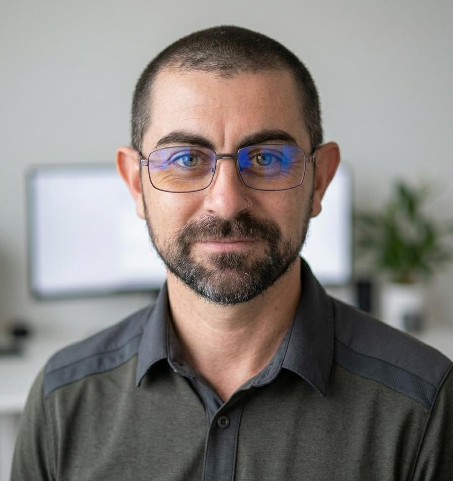

<!-- CV-MauricioPintos-Infra_SecOps.md -->
<!-- CV 3 - Para Infraestructura / SecOps -->

# Mauricio Pintos 

📍 Buenos Aires, Argentina    
📧 mauricioenrique.pintos@estudiantes.unahur.edu.ar    
📱 +54 9 11 6583-5046    
🔗 LinkedIn: https://www.linkedin.com/in/mauricio-pintos-783272240    
💻 GitHub: https://github.com/mauriciopintos    

---

Perfil Profesional

Profesional IT con más de 15 años de experiencia en administración de infraestructura tecnológica, soporte crítico, automatización y continuidad operativa.

Experiencia en entornos productivos de alta disponibilidad, administración Windows/Linux, redes corporativas, scripting y estrategias de resiliencia operacional.

Orientado a seguridad operativa, troubleshooting avanzado y mejora continua.

---

Experiencia Profesional

Poder Judicial de la Provincia de Buenos Aires

Responsable Técnico Departamental | Soporte Técnico IT N2/N3

2010 – Actualidad

Administración integral de infraestructura tecnológica.

Gestión de servidores Windows/Linux y bases de datos.

Administración de redes corporativas.

Implementación de automatizaciones operativas.

Diseño de políticas de respaldo y continuidad operativa.

Estrategias anti-ransomware y backups offline.

Coordinación técnica de equipos y proyectos.

Resolución de incidentes críticos.

---

Stack Técnico

Infraestructura

Windows Server

Linux

Active Directory

GPO

Exchange On-Premise

VMware

Hyper-V

VirtualBox

Redes corporativas

MSSQL

Automatización

PowerShell

Bash

Python

Scripting administrativo

Seguridad Operativa

Estrategias de backup

Resiliencia operativa

Continuidad operativa

Hardening básico

Gestión de incidentes

---

Proyecto Destacado

Plataforma de Respaldo Distribuido y Estrategia Anti-Ransomware

Sistema automatizado APH.

Replicación multi-site cifrada.

Backups offline diarios.

Gestión eficiente de energía y seguridad.

Implementación replicada en múltiples departamentos.

---

Formación Académica

Licenciatura en Informática – UNAHUR (en curso)

Tecnicatura Universitaria en Redes y Operaciones – UNAHUR

Tecnicatura Universitaria en Programación – UNAHUR

---

Headline LinkedIn

QA Técnico

QA Técnico SSR | APIs REST | Testing Funcional | Troubleshooting | Automatización | Infraestructura IT

Automation / DevOps

Automation & Infrastructure Specialist | PowerShell | Linux | Windows Server | APIs | DevOps Jr

Infra / SecOps

Infrastructure & Security Operations Specialist | Windows/Linux | Automatización | Resiliencia Operativa

---

About LinkedIn

Profesional IT y Docente Universitario con más de 15 años de experiencia en infraestructura tecnológica, troubleshooting avanzado, automatización de procesos y soporte en entornos críticos.

A lo largo de mi carrera trabajé en administración de servidores Windows/Linux, redes, bases de datos y automatización mediante PowerShell, Bash y Python, además de participar en validación funcional de sistemas, testing de APIs REST y documentación técnica.

Complemento mi experiencia operativa con formación y docencia universitaria en programación estructurada, orientación a objetos y testing.

Actualmente enfocado en oportunidades relacionadas con QA Técnico, Automation, DevOps Jr y operaciones IT modernas.

---

Bio corta recruiter

Profesional IT con 15+ años en infraestructura crítica, automatización y troubleshooting. Experiencia en testing funcional, APIs REST, scripting PowerShell/Python/Bash y docencia universitaria en programación.

---
